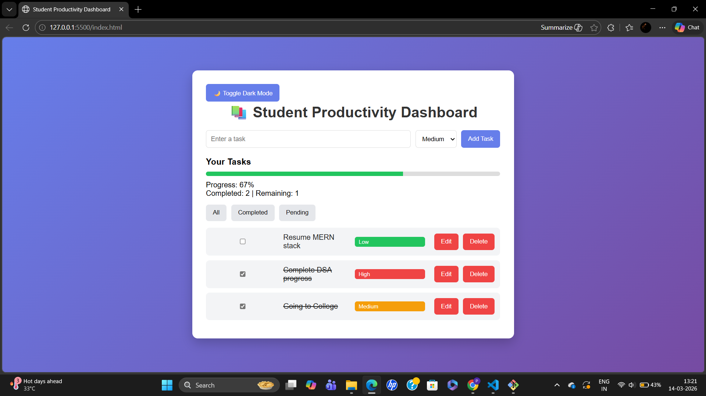
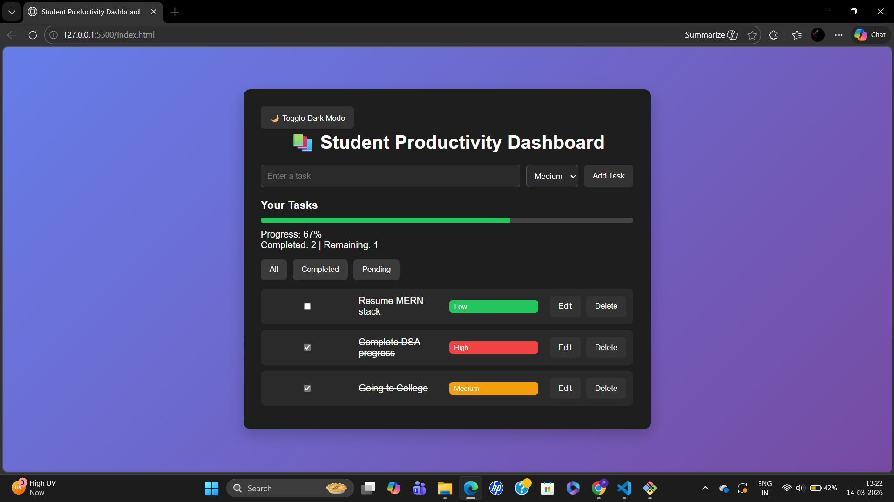

## 🚀 Features

- Add new tasks
- Edit existing tasks
- Delete tasks
- Mark tasks as completed
- Priority levels (High, Medium, Low)
- Task filtering (All / Completed / Pending)
- Progress tracking with progress bar
- Task statistics (Completed / Remaining)
- Dark mode toggle
- Data persistence using LocalStorage
- Responsive and modern UI

## 🛠 Technologies Used

- HTML5
- CSS3
- JavaScript (Vanilla JS)
- LocalStorage API

## ▶️ How to Run

1. Clone the repository

git clone https://github.com/yourusername/student-productivity-dashboard.git

2. Open the project folder

3. Open `index.html` in your browser

## Project Structure

Student Productivity Dashboard
│
├── index.html
├── styles.css
├── script.js
├── README.md
└── images
    └── dashboard-lightmode.png
    └── dashboard-darkmode.png

## Screenshot

